# Lab 3 - Build a RAG application using Azure OpenAI and Azure AI Search and deploy to Azure App Service

**Time Duration: 50 mins**

In this tutorial, you'll create a .NET retrieval augmented generation
(RAG) application using .NET Blazor, Azure OpenAI, and Azure AI Search
and deploy it to Azure App Service. This application demonstrates how to
implement a chat interface that retrieves information from your
documents and leverages Azure AI services to provide accurate,
contextually aware answers with proper citations. The solution uses
managed identities for passwordless authentication between services.

In this tutorial, you learn how to:

- Deploy a Blazor application that uses RAG pattern with Azure AI
  services.

- Configure Azure OpenAI and Azure AI Search for hybrid search.

- Upload and index documents for use in your AI-powered application.

- Use managed identities for secure service-to-service communication.

- Test your RAG implementation locally with production services.

**Architecture overview**

Before you begin deployment, it's helpful to understand the architecture
of the application you'll build. The following diagram is from custom
RAG pattern for Azure AI Search:  

In this tutorial, the Blazer application in App Service takes care of
both the app UX and the app server. However, it doesn't make a separate
knowledge query to Azure AI Search. Instead, it tells Azure OpenAI to do
the knowledge querying, specifying Azure AI Search as a data source.
This architecture offers several key advantages:

- **Integrated Vectorization**: Azure AI Search's integrated
  vectorization capabilities make it easy and quick to ingest all your
  documents for searching, without requiring more code for generating
  embeddings.

- **Simplified API Access**: By using the Azure OpenAI on your
  data pattern with Azure AI Search as a data source for Azure OpenAI
  completions, there's no need to implement complex vector search or
  embedding generation. It's just one API call, and Azure OpenAI handles
  everything, including prompt engineering and query optimization.

- **Advanced Search Capabilities**: The integrated vectorization
  provides everything needed for advanced hybrid search with semantic
  reranking, which combines the strengths of keyword matching, vector
  similarity, and AI-powered ranking.

- **Complete Citation Support**: Responses automatically include
  citations to source documents, making information verifiable and
  traceable.

**Prerequisites**

- A GitHub account for using GitHub Codespaces. If you don’t have GitHub
  account, then you can create
  from [here](https://github.com/signup?ref_cta=Sign+up&ref_loc=header+logged+out&ref_page=%2F&source=header-home).

## Task 1: Open GitHub Codespaces

The easiest way to get started is using GitHub Codespaces, which
provides a complete development environment with all required
preinstalled tools.

1.  From **C:** **extract** the **Labfiles zip** file.

2.  Navigate to the GitHub repository
    +++https://github.com/technofocus-pte/appserviceragopenai+++ and
    sign in using your GithHub credentials.

3.  Click on **Fork** to fork the repo.

    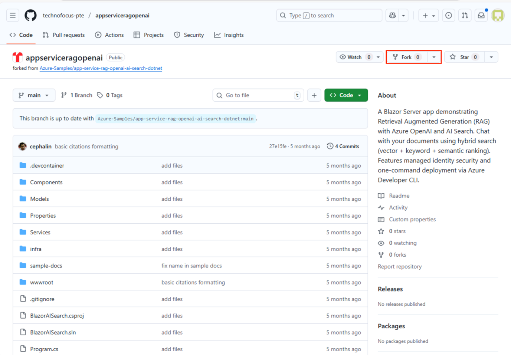

4.  Click on **Create fork**.

    

5.  Once forked, click on **Code** \> **Codespaces** \> **Create
    codespace on main** to open a new codespace.

    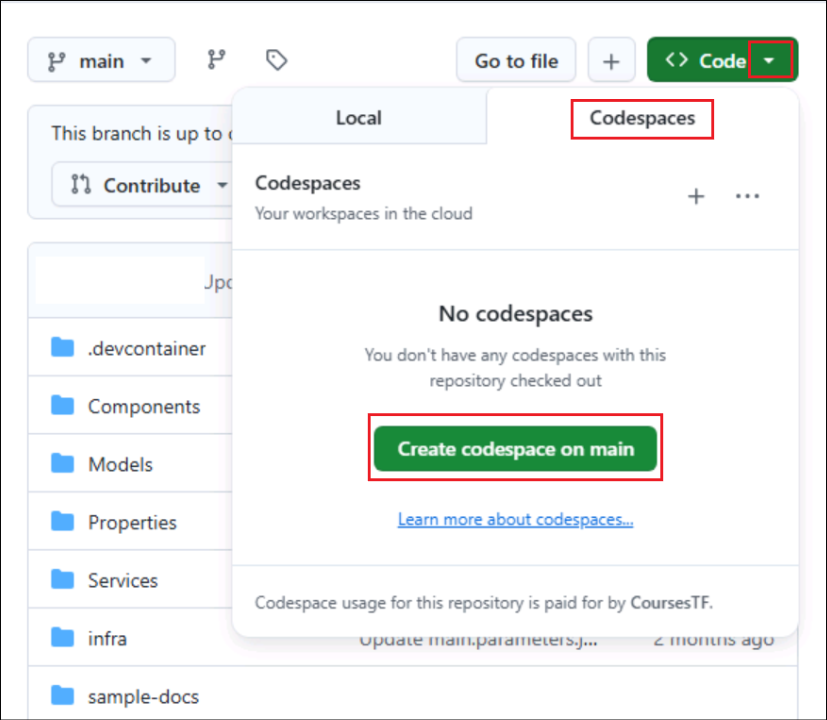

6.  Wait for the codespace environment to set up. It takes a few minutes
    to set up completely.

    

    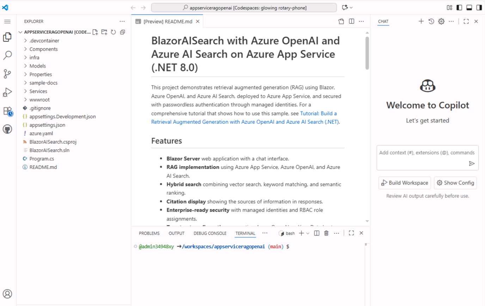

## Task 2: Deploy the given architecture

In this exercise, you are going to deploy the provided architecture to
your Azure account.

1.  In the terminal, log into your Azure using Azure Developer CLI:

    +++azd auth login+++

    

2.  Copy the code and then press the **Enter** key, and it will open a
    new browser window where you need to enter the given code and then
    click the **Next** button.

    

3.  Sign-in to your **Azure account** using the following credentials
    and then click on the **Continue** button.

    - Username: <+++@lab.CloudPortalCredential>(User1).Username+++

    - TAP Token: <+++@lab.CloudPortalCredential>(User1).AccessToken+++

    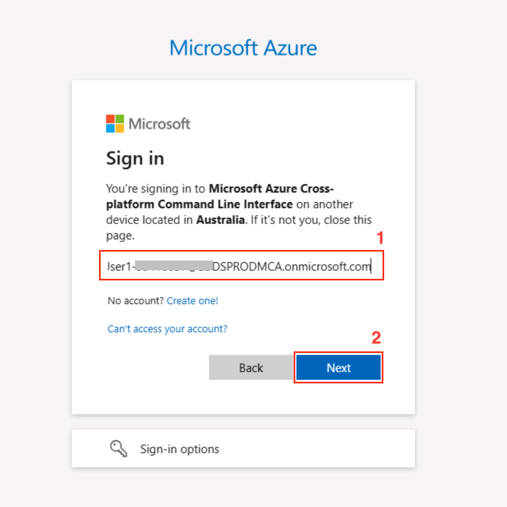

    

    

    Now your account is successfully connected with the Codespace terminal.

    

    

4.  In the terminal, execute the following command to provision the
    Azure resources with the AZD template:

    +++azd provision+++

    

5.  When prompted, enter the following details:

    - **Enter a new environment
      Name:** <+++blazorenv@lab.LabInstance.Id>+++

    - **Select Azure Subscription to use:** Select the subscription

    - **Pick a resource group to use:** Select **ResourceGroup1**

    

6.  Wait for the deployment to complete; it will take 5-10 mins. This
    process will:

    - Create all required Azure resources.

    - Deploy the application to Azure App Service.

    - Configure secure service-to-service authentication using managed
      identities.

    - Set up the necessary role assignments for secure access between
      services.

    After successful deployment, you'll see a URL for your deployed
application.

    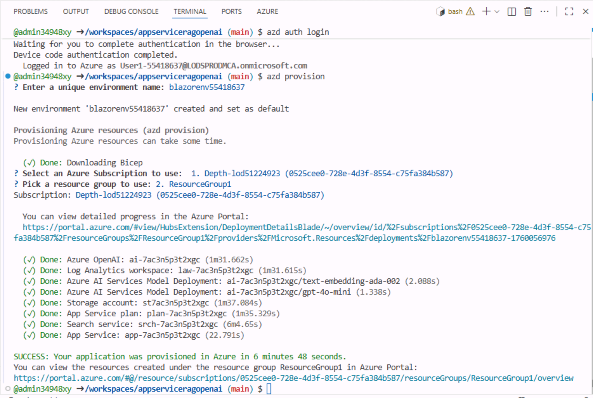

## Task 3: Upload documents and create a search index

Now that the infrastructure is deployed, you need to upload documents
and create a search index that the application will use.

1.  Open the given URL using **Ctrl+Click** to view all the created
    resources.

    

2.  Select the **storage account** that was created by the deployment.

    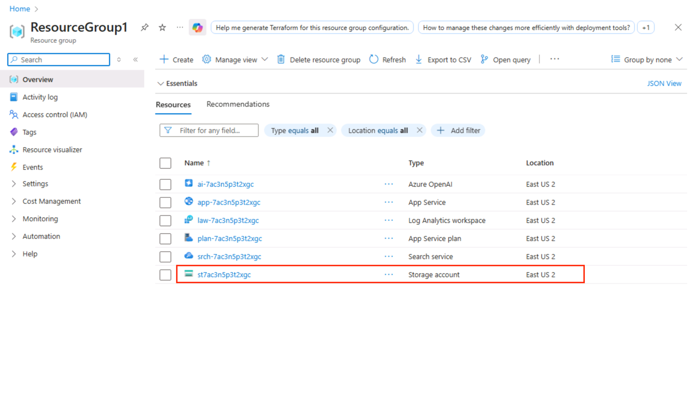

3.  Select **Containers** under **Data Storage** from the left
    navigation menu and open the **documents** container. The document
    container is empty. Now you will upload documents into it.

    

4.  Click on the **Upload** button.

    

5.  Click on **Browse for files**, navigate
    to **C:\LabFiles\Build-a-RAG-application-using-Azure-OpenAI-and-Azure-AI-Search-and-deploy-to-Azure-App-Service**,
    select all five documents, and then click the **Open** button.

    

    

6.  Then click the **Upload**.

    

    You can view these files in the document container.

    

7.  Navigate back to the ResourceGroup1 and select the **Search
    service**.

    

8.  Copy the URI and save it in the Notepad for future use.

    

9.  Select **Import data(new)** to start the process of creating a
    search index from the overview page.

    

10. Select **Azure Blob Storage** as the Data Source.

    

11. Select **RAG**.

    

12. Choose your **storage account** and the **documents** container.
    Ensure that **Authenticate using managed identity** is selected, and
    then click **Next**.

    

13. Choose your **Azure OpenAI service** and
    select **text-embedding-ada-002** as the embedding model. The AZD
    template has already deployed this model. Then, select **System
    assigned identity** for authentication and check the acknowledgement
    checkbox for additional costs. Click on the **Next** button.

    

14. In the **Vectorize and enrich your images** step, keep the default
    settings as it is and select **Next**.

    

15. Ensure **Enable semantic ranker** is selected and then click Next.

    

16. Copy the **Objects name prefix** value in Notepad for future use, as
    it is your search index name. Now, click **Create** to start the
    indexing process. 

17. Wait for the indexing process to complete. This might take a few
    minutes, depending on the size and number of your documents. Once
    the process is complete, click **Close**.

    

18. Again, open the resource group and select Azure OpenAI service.

    

19. Select the **Endpoint** and then copy the value of the endpoint in
    Notepad for future use.

    

    

20. Navigate to Codespace terminal, set the search index name as an AZD
    environment variable:

    +++azd env set SEARCH_INDEX_NAME < your-search-index-name >+++

    **Note:** Replace < your-search-index-name >with the index name you
copied previously. AZD uses this variable in subsequent deployments to
set the App Service app setting.

    

## Task 4: Test the application and deploy

In this task, you will test the application either before or after
deployment directly from your Codespace. Once you’ve confirmed that the
application is functioning properly, proceed with the deployment.

1.  In the Codespace terminal, get the AZD environment values using the
    following command.

    +++azd env get-values+++

    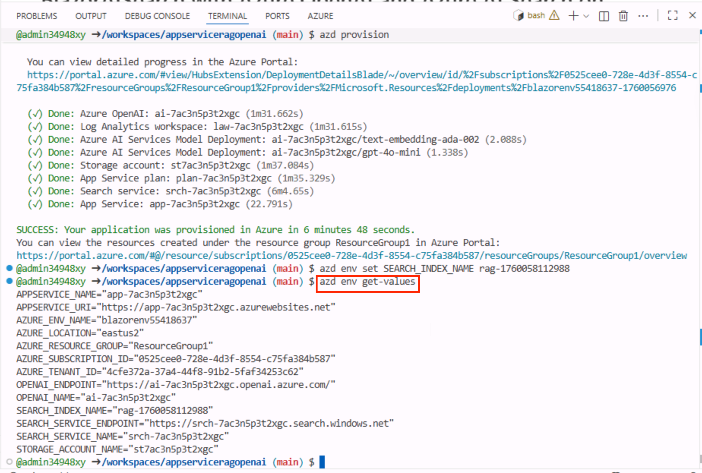

2.  Open **appsettings.Development.json.** Using the terminal output,
    update the values of:

    - "OpenAIEndpoint": "< value-of-OPENAI_ENDPOINT >"

    - "SearchServiceUrl": "< value-of-SEARCH_SERVICE_ENDPOINT >",

    - "SearchIndexName": "< value-of-SEARCH_INDEX_NAME >", 
    
    

3.  Sign in to Azure with the Azure CLI:

    +++az login --use-device-code+++ 

    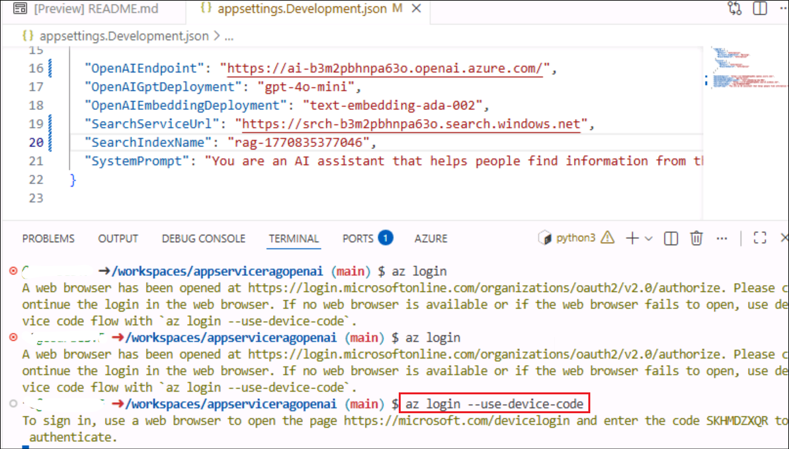

4.  Open the given **URL** and enter the authentication code, and then
    click on the **Next** button.

    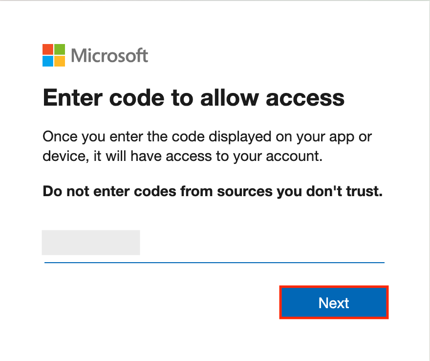

5.  Select your Azure account and then click on **Continue**.

    

    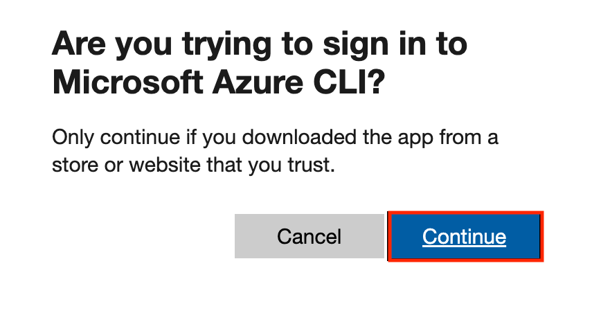

    

6.  Run the application locally:

    +++dotnet run+++

    

7.  When you see that **your application running on port 5017 is
    available**, select **Open in Browser.**

    

    It will open the app in a browser.

    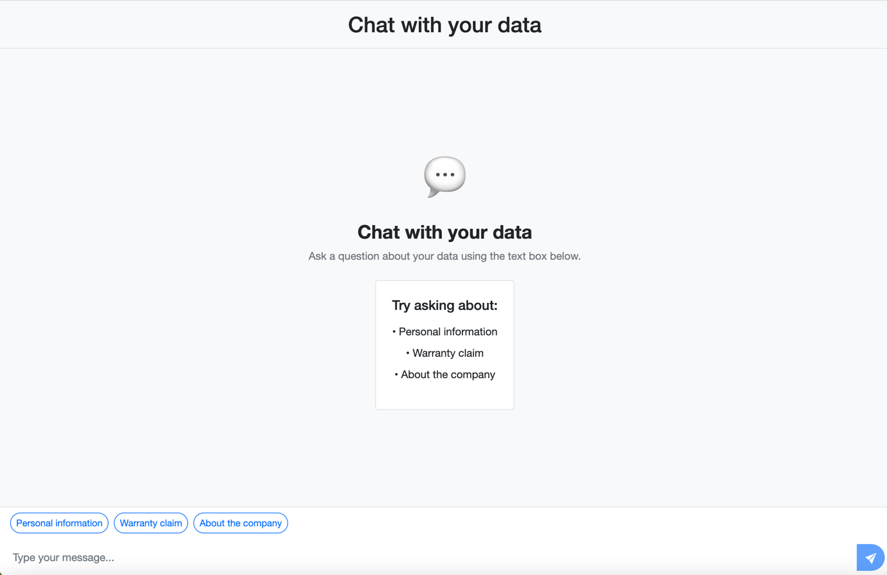

8.  Enter the following prompt. If you get a response, your application
    is connecting successfully to the Azure OpenAI resource.

    +++What does Contoso do with my personal information?+++

    

9.  Press **Ctrl+C** to terminate the running command. Next, deploy the
    application using the following command.

    +++azd up+++

    

    **Note:** It will take 5-10 mins to complete the deployment.

## Task 5: Test the deployed RAG application

With the application fully deployed and configured, you can now test the
RAG functionality:

1.  Open the application URL provided at the end of the deployment. When
    the prompt appears asking, 'Do you want Code to open the external
    website?', click **Open**.

    

    

    You see a chat interface where you can enter questions about the content
    of your uploaded documents.

    

2.  Ask the following questions:

    +++**How does Contoso use my personal data?**+++

    +++**How do you file a warranty claim?**+++

    Observe how the responses include citations that reference the source
    documents. These citations help users verify the accuracy of the
    information and find more details in the source material.

    

    The pop-up appears when you click on the blue circles labelled 1 or 2,
    positioned at the end of each line.

    

    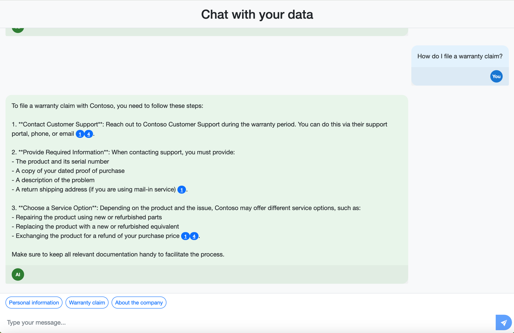

    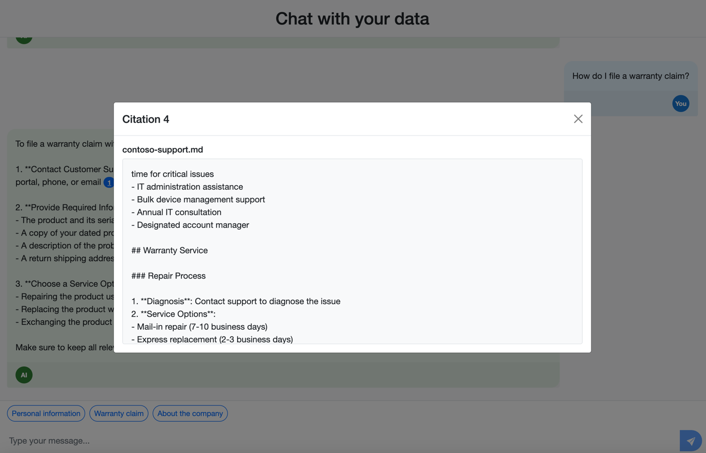

## Summary

In this lab, you provision Azure resources to build a RAG-based .NET
Blazor web application integrating Azure OpenAI and Azure AI Search. You
configure hybrid search with document indexing and embeddings to enable
contextual Q&A with citations. The application is tested locally in
GitHub Codespaces using managed identity for secure access. Finally,
it’s deployed to Azure App Service and validated through a live chat
interface powered by Azure AI.
