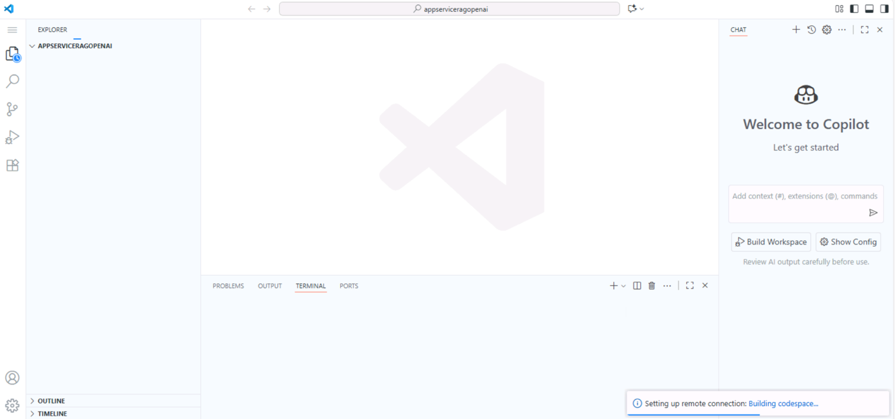
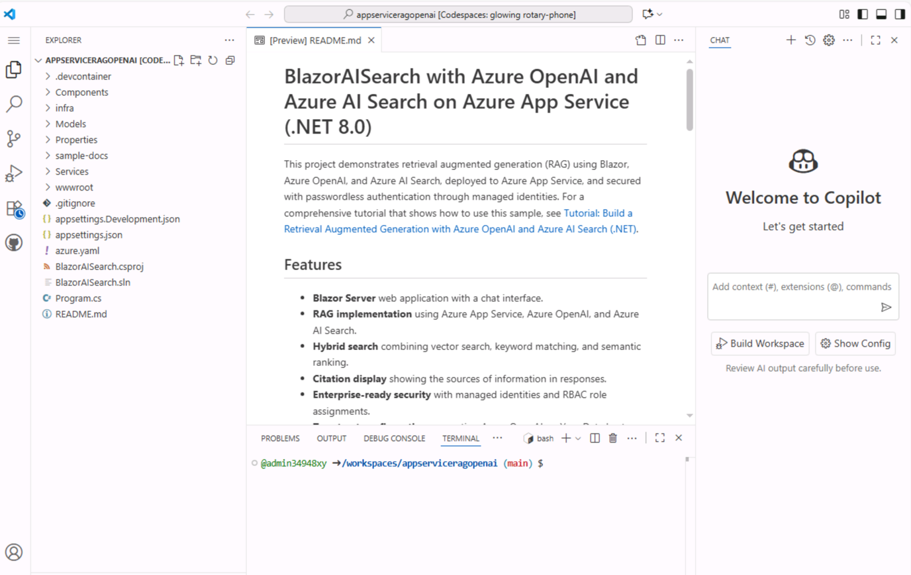
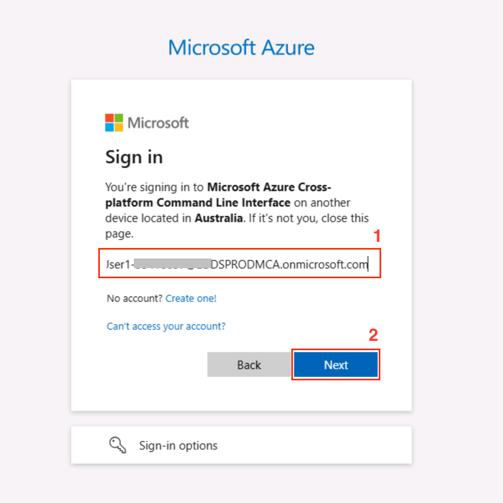
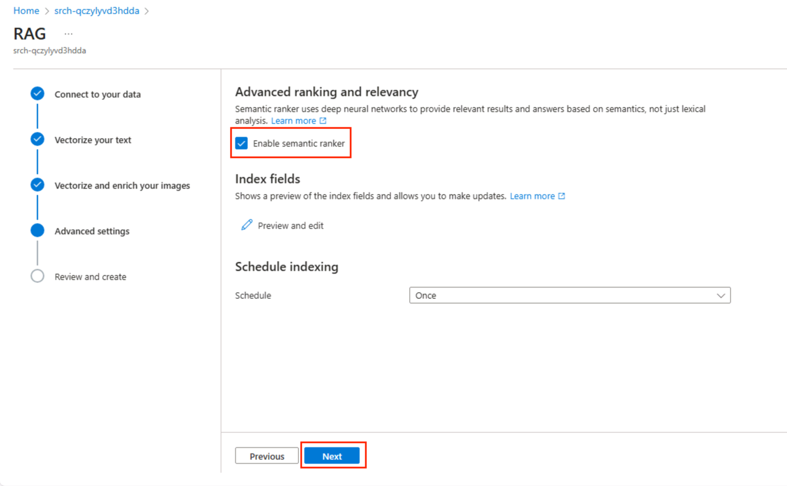
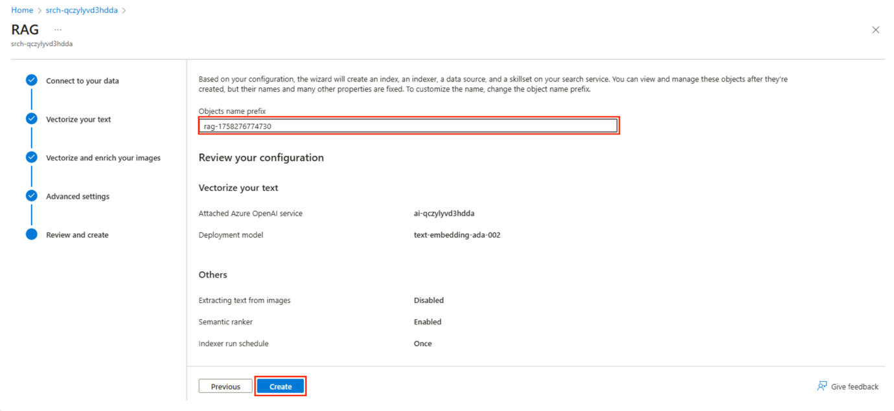
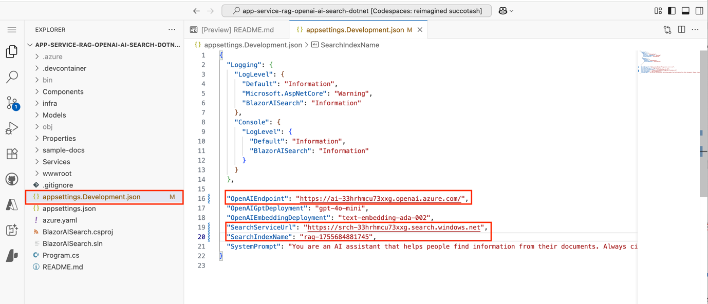
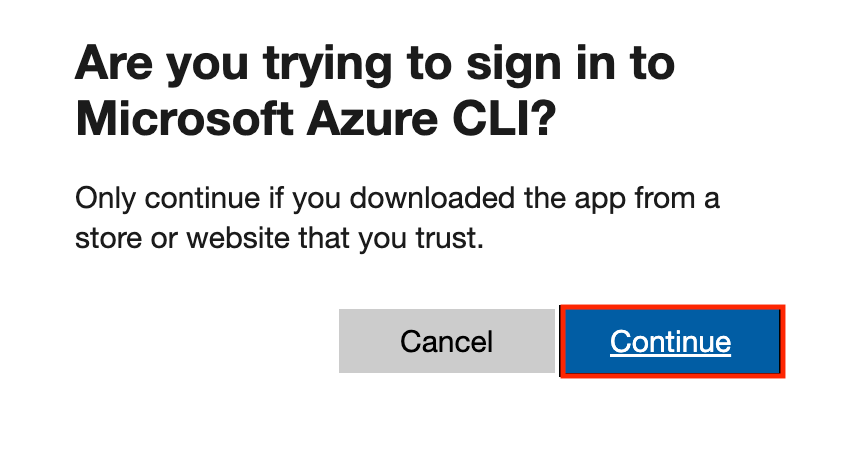
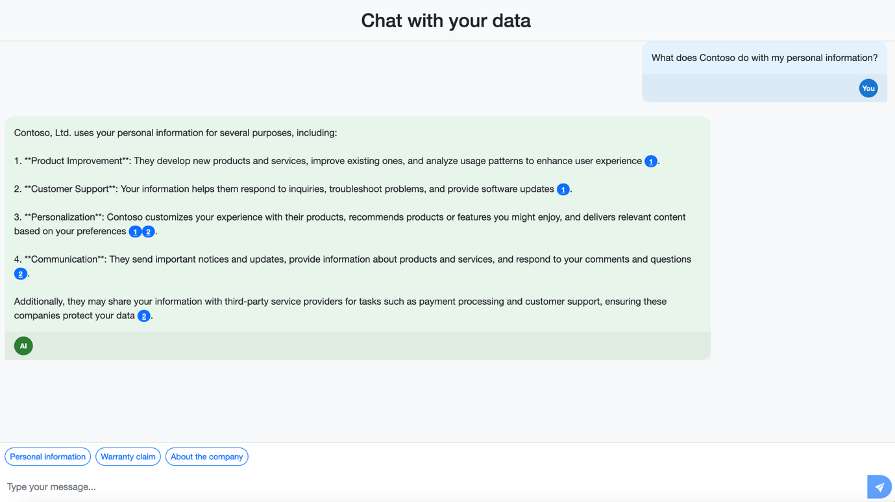

# ラボ3 - Azure OpenAI（テキスト埋め込みモデル）とAzure AI Searchを使用して検索拡張生成（RAG）アプリケーションを構築し、Azure App Serviceにデプロイする

**所要時間：45分**

このチュートリアルでは、.NET Blazor、Azure OpenAI、Azure AI Search
を使用して .NET 取得拡張生成 (RAG) アプリケーションを作成し、Azure App
Service
にデプロイします。このアプリケーションは、ドキュメントから情報を取得し、Azure
AI
サービスを活用して適切な引用を含む正確で文脈に応じた回答を提供するチャット
インターフェイスの実装方法を示します。このソリューションでは、サービス間のパスワードレス認証にマネージド
ID を使用します。

このチュートリアルでは、以下の方法を学びます。

- Azure AI サービスと RAG パターンを使用する Blazor
  アプリケーションをデプロイします。

- ハイブリッド検索のために、Azure OpenAIとAzure AI Searchを構成します。

- AI搭載アプリケーションで使用するドキュメントをアップロードしてインデックス化します。

- サービス間の安全な通信には、マネージドIDを使用してください。

- RAGの実装を、本番エンビロンメントのサービスと連携させてローカルでテストしてください。

**アーキテクチャの概要**

デプロイを開始する前に、構築するアプリケーションのアーキテクチャを理解しておくと役立ちます。次の図は、Azure
AI Search 用のカスタム RAG パターンからのものです。

このチュートリアルでは、App Service の Blazer アプリケーションがアプリの
UX とアプリ サーバーの両方を処理します。ただし、Azure AI Search
に対して個別の知識クエリは実行しません。代わりに、Azure OpenAI
に知識クエリを実行するように指示し、データ ソースとして Azure AI Search
を指定します。このアーキテクチャには、いくつかの重要な利点があります。

- **統合されたベクトル化**：Azure AI Search
  の統合されたベクトル化機能により、埋め込みを生成するための追加のコードを必要とせずに、すべてのドキュメントを簡単かつ迅速に検索対象として取り込むことができます。

- **API アクセスの簡素化**：Azure OpenAI をデータパターンに適用し、Azure
  AI Search を Azure OpenAI
  補完のデータソースとして使用することで、複雑なベクトル検索や埋め込み生成を実装する必要がなくなります。API
  呼び出しは 1 回だけで済み、プロンプト
  エンジニアリングやクエリ最適化など、すべて Azure OpenAI が処理します。

- **高度な検索機能**：統合されたベクトル化により、キーワードマッチング、ベクトル類似性、AIによるランキングの強みを組み合わせた、セマンティック再ランキングによる高度なハイブリッド検索に必要なすべてが提供されます。

- **完全な引用サポート**：回答には自動的に出典文書への引用が含まれるため、情報の検証と追跡が可能になります。

**前提条件**

- Codespacesを使用するにはGitHubアカウントが必要です。GitHubアカウントをお持ちでない場合は、[こちらから作成できます](https://github.com/signup?ref_cta=Sign+up&ref_loc=header+logged+out&ref_page=%2F&source=header-home)。

## タスク1：GitHub Codespacesを開く

最も簡単に始める方法は、GitHub Codespaces
を利用することです。これは、必要なツールがすべてプリインストールされた完全な開発エンビロンメントを提供します。

1.  **C**ドライブから、**Labfilesのzip**ファイルを解凍してください。

2.  GitHubリポジトリ+++https://github.com/technofocus-pte/appserviceragopenai+++、
    GithHubの認証情報を使用してサインインしてください。

3.  リポジトリをフォークするには、 **「Fork」**をクリックしてください。

    

4.  **「Create fork」**をクリックします。

    

5.  フォークしたら、 **\[Code** \> **Codespaces** \> **Create codespace
    on main\]**をクリックして新しいCodespaceを開きます。

    

6.  Codespaceエンビロンメントのセットアップが完了するまでお待ちください。セットアップには数分かかります。

    

    

## タスク2：指定されたアーキテクチャをデプロイする

この演習では、提供されたアーキテクチャをAzureアカウントにデプロイします。

1.  ターミナルで、Azure Developer CLI を使用して Azure
    にログインします。

    +++azd auth login+++

    

2.  コードをコピーして**Enter**キーを押すと、新しいブラウザウィンドウが開きます。そこにコピーしたコードを入力し、「**Next」**ボタンをクリックしてください。

    

3.  以下の認証情報を使用して**Azureアカウント**にサインインし、
    **\[Countinue\]**ボタンをクリックしてください。

    - ユーザー名: [+++@
      lab.CloudPortalCredential](mailto:+++@lab.CloudPortalCredential)
      (User1 ).Username+++

    - TAPトークン: [+++@
      lab.CloudPortalCredential](mailto:+++@lab.CloudPortalCredential)
      (User1 ). AccessToken+++

    

    

    

    Codespaceターミナルに正常に接続されました。

    

    

4.  ターミナルで、次のコマンドを実行して、AZDテンプレートを使用してAzureリソースをプロビジョニングします。

    +++azd provision +++

    

5.  指示が表示されたら、以下の詳細を入力してください。

    - **Enter a new environment Name:** [+++
      blazorenv@lab.LabInstance.Id](mailto:+++blazorenv@lab.LabInstance.Id)
      +++

    - **Select Azure Subscription to
      use:**サブスクリプションを選択してください

    - **Pick a resource group to use: ResourceGroup1**を選択してください

    

6.  デプロイが完了するまでお待ちください。5～10分かかります。このプロセスでは以下のことが行われます。

    - 必要なAzureリソースをすべて作成します。

    - アプリケーションをAzure App Serviceにデプロイします。

    - マネージドIDを使用して、安全なサービス間認証を設定します。

    - サービス間の安全なアクセスを確保するために必要な役割割り当てを設定します。

    デプロイが正常に完了すると、デプロイされたアプリケーションのURLが表示されます。

    

## タスク3：ドキュメントをアップロードして検索インデックスを作成する

インフラストラクチャの展開が完了したので、ドキュメントをアップロードし、アプリケーションが使用する検索インデックスを作成する必要があります。

1.  **Ctrlキー**を押しながら指定されたURLをクリックして、作成されたすべてのリソースを表示してください。

    

2.  デプロイメントによって作成された**ストレージアカウント**を選択してください。

    

3.  左側のナビゲーションメニューから**「Data
    Storage」**の下にある**「Containers」を**選択し、
    **「documents」**コンテナを開きます。ドキュメントコンテナは空です。これからドキュメントをアップロードしていきます。

    

4.  **Upload**ボタンをクリックしてください。

    

5.  **「Browse for files」**をクリックし、
    **C:\LabFiles\Build-a-RAG-application-using-Azure-OpenAI-and-Azure-AI-Search-and-deploy-to-Azure-App-Service**
    に移動して、5 つのドキュメントすべてを選択し、
    **「Open」**ボタンをクリックします。

    

    

6.  次に**「Upload」**をクリックします。

    

    これらのファイルはドキュメントコンテナ内で閲覧できます。

    

7.  ResourceGroup1 に戻り、**Search service**を選択します。

    

8.  URIをコピーしてメメモ帳に保存し、後で使用してください。

    

9.  Overviewページから、「**Import
    data(new)**」を選択し、検索インデックスの作成プロセスを開始します。

    

10. データソースとして**Azure Blob Storage**を選択します。

    

11. **RAG**を選択してください。

    

12. **ストレージアカウント**と**ドキュメント**コンテナを選択します。
    **「Authenticate using managed
    identity」**が選択されていることを確認し、
    **「Next」**をクリックします。

    

13. **Azure OpenAI
    サービス**を選択し、埋め込みモデルとして**text-embedding-ada-002**を選択します**。**AZD
    テンプレートには既にこのモデルがデプロイされています。次に、**System
    assigned
    identity** を選択し、追加費用に関する確認チェックボックスをオンにします。**\[Next\]**ボタンをクリックします。

    

14. **「Vectorize and enrich your
    images」**ステップでは、デフォルト設定のままにして**「Next」**を選択します。

    

15. **「Enable semantic
    ranker」**が選択されていることを確認し、「Next」をクリックします。

    

16. **Objects name
    prefix**の値をメモ帳にコピーしておいてください。これは検索インデックス名になります。次に、
    **「Create」**をクリックしてインデックス作成プロセスを開始します。
    
    

17. インデックス作成処理が完了するまでお待ちください。ドキュメントのサイズと数によっては、数分かかる場合があります。処理が完了したら、
    **「Close」**をクリックしてください。

    

18. 再度、リソースグループを開き、Azure
    OpenAIサービスを選択してください。

    

19. **エンドポイント**を選択し、そのエンドポイントの値をメモ帳にコピーして、後で使用できるように保存してください。

    

    

20. Codespaceターミナルに移動し、検索インデックス名をAZDエンビロンメント変数として設定します。

    +++ azd env set SEARCH_INDEX_NAME \<your-search-index-name\>+++

    **注：**
    <your-search-index-name>を、以前コピーしたインデックス名に置き換えてください。AZDはこの変数を使用して、以降のデプロイでApp Serviceアプリの設定を行います。

    

## タスク4：アプリケーションのテストとデプロイ

Codespaceから直接、デプロイ前またはデプロイ後にアプリケーションをテストします。アプリケーションが正しく動作することを確認したら、デプロイに進んでください。

1.  Codespaceのターミナルで、以下のコマンドを使用してAZDエンビロンメントの値を取得します。

    +++ azd env get-values+++

    

2.  **appsettings.Development.json**を開きます**。**ターミナルの出力を使用して、以下の値を更新します。

    - "OpenAIEndpoint": "<value-of-openai_ENDPOINT>"

    - "SearchServiceUrl": "< value-of-SEARCH_SERVICE_ENDPOINT>",

    - " SearchIndexName ": "< value-of-SEARCH_INDEX_NAME>",
    
    

3.  Azure CLI を使用して Azure にサインインします。

    +++ az login --use-device-code+++

    

4.  指定された**URL**を開き、認証コードを入力してから、
    **「Next」**ボタンをクリックしてください。

    

5.  Azureアカウントを選択し、**「Continue」**をクリックしてください。

    

    

6.  アプリケーションをローカルで実行します。

    +++dotnet run+++

    

7.  **ポート5017で実行されているアプリケーションが利用可能になった(your
    application running on port 5017 is
    available)**ことを確認したら、**「Open in
    Browser」**を選択してください。

    

    アプリがブラウザで開きます。

    

8.  次のプロンプトを入力してください。応答があれば、アプリケーションはAzure
    OpenAIリソースに正常に接続されています。

    +++ What does Contoso do with my personal information?+++
    
    

9.  **Ctrl+C**を押してください。次に、以下のコマンドを使用してアプリケーションをデプロイします。

    +++ azd up+++

    

**注：**デプロイ完了まで5～10分かかります。

## タスク5：デプロイしたRAGアプリケーションをテストする

アプリケーションのデプロイと設定が完了したら、RAGの機能をテストできます。

1.  デプロイの最後に表示されるアプリケーションの URL を開きます。「'Do
    you want Code to open the external
    website?」というプロンプトが表示されたら、**「**Open**」**をクリックします。

    

    

    アップロードしたドキュメントの内容に関する質問を入力できるチャットインターフェースが表示されます。

    

2.  以下の質問をしてください。

    +++**How does Contoso use my personal data?**+++

    +++**How do you file a warranty claim?**+++

    回答には、出典となる文書を参照する引用が含まれていることに注目してください。これらの引用は、ユーザーが情報の正確性を確認し、出典資料からより詳細な情報を見つけるのに役立ちます。

    

    各行の末尾にある、1または2とラベル付けされた青い丸をクリックすると、ポップアップが表示されます。

    

    

    

## まとめ

このラボでは、Azureリソースをプロビジョニングして、Azure OpenAIとAzure
AI Searchを統合したRAGベースの.NET Blazor
Webアプリケーションを構築します。ドキュメントのインデックス作成と埋め込み機能を備えたハイブリッド検索を構成し、引用を含むコンテキストに応じたQ&Aを実現します。アプリケーションは、マネージドIDを使用してGitHub
Codespacesでローカルにテストされ、安全なアクセスが確保されます。最後に、Azure
App Serviceにデプロイされ、Azure
AIを搭載したライブチャットインターフェイスを通じて検証されます。
