# 실습 3 - Azure OpenAI (텍스트 임베딩 모델) 및 Azure AI Search를 사용하여 retrieval augmented generation (RAG) 애플리케이션을 구축하고 Azure App Service로 배포하기

**예상 소요 시간: 45분**

이 튜티리열에서는 .NET Blazor, Azure OpenAI, 및 Azure AI Search를
사용하여 .NET retrieval augmented generation (RAG) 애플리케이션을
생성하고 Azure App Service에 배포할 것입니다. 이 애플리케이션은 문서에서
정보를 검색하는 채팅 인터페이스 구현하는 방법을 시연하며 Azure AI
서비스를 활용해 정확한 문맥 답변과 적절한 인용을 제공합니다. 이 솔루션은
서비스 간 비밀번호 없는 인증을 위해 관리형 ID를 사용합니다.

이 튜토리열에서는 다음을 수행할 것입니다:

- Azure AI 서비스와 함께 RAG패턴을 사용하는 Blazor애플리케이션을
  배포하기

- Azure OpenAI와 Azure AI Search를 하이브리드 검색용으로 구성하기

- AI 기반 애플리케이션에서 사용할 문서를 업로드하고 색인화하기

- 안전한 서비스 간 통신을 위해 관리 ID를 사용하기

- RAG 구현을 생산 서비스와 함께 로컬에서 테스트하기

**아키텍처 개요**

배포를 시작하기 전에 구축할 애플리케이션의 아키텍처를 이해하는 것이
도움이 됩니다. 다음 도표는 Azure AI Search용 사용자 지정 RAG패턴에서
가져온 것입니다:  

이 튜토리열에서는 앱 서비스의 Blazer 에플리케이션이 앱 UX와 앱 서버
모두를 담당합니다. 하지만 Azure AI Search에 별도의 지식 쿼리를 생성하지
않습니다. Instead, it tells 대신 Azure OpenAI에 지식 쿼리를 수행하도록
지시하며 Azure AI Search를 데이터 소스로 지정합니다. 이 아키텍처를 여러
가지 주요 장점을 제공합니다:

- **통합 벡터화**: Azure AI Search의 통합 벡터화 기능은 임베딩 생성에
  추가 코드를 필요로 하지 않고도 모든 문서를 쉽고 빠르게 검색할 수 있게
  해줍니다.

- **간소화된 API 접근**: Azure OpenAI를 데이터 패턴에 적용하고, Azure AI
  Search를 Azure OpenAI 완료 데이터 소스로 사용하면, 복잡한 벡터
  검색이나 임베딩 생성을 구현할 필요가 없습니다. API 호출 하나뿐이고,
  Azure OpenAI가 프롬프트 엔지니어링과 쿼리 최적화 등 모든 것을
  처리합니다.

- **고급 검색 능력**: 통합 벡터화는 키워드 매칭, 벡터 유사성, AI 기반
  순위의 강점을 결합한 semantic 재랭킹과 함께 고급 하이브리드 검색에
  필요한 모든 것을 제공합니다.

- **완전한 인용 지원**: 응답에는 자동으로 출처 문서에 대한 인용이
  포함되어 있어 정보를 검증하고 추적 가능하게 생성합니다.

**필수 구성 요소**

- GitHub Codespaces를 사용하기 위한 GitHub 계정. GitHub 계정이 없다면
  [here](https://github.com/signup?ref_cta=Sign+up&ref_loc=header+logged+out&ref_page=%2F&source=header-home)에서
  생성할 수 있습니다.

## 작업 1: GitHub Codespaces를 열기

가장 쉬운 시작 방법은 GitHub Codespaces를 사용하는 것으로, 필요한 모든
사전 설치 도구가 포함된 완전한 개발 환경을 제공합니다.

1.  **C:** **extract**에서 **Labfiles zip** 파일을 선택하세요.

2.  GitHub 저장소
    +++<https://github.com/technofocus-pte/appserviceragopenai+++>로
    이동하고 GithHub 자격 증명으로 로그인하세요.

3.  repo를 포그하려면 **Fork**를 클릭하세요.

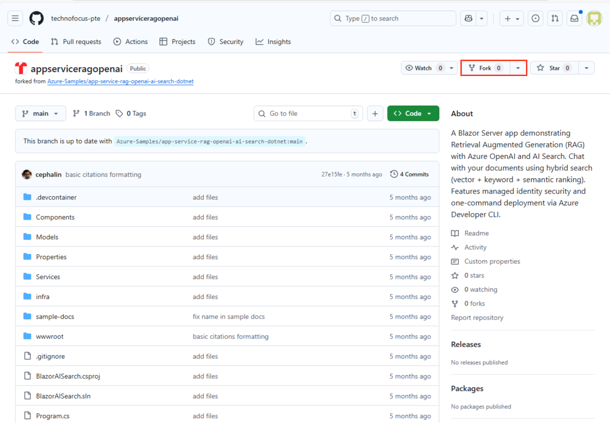

4.  **Create fork**를 클릭하세요.

5.  포크되면 새 코드스페이스를 열려면
    **Code** \> **Codespaces** \> **Create codespace on main**을
    클릭하세요.

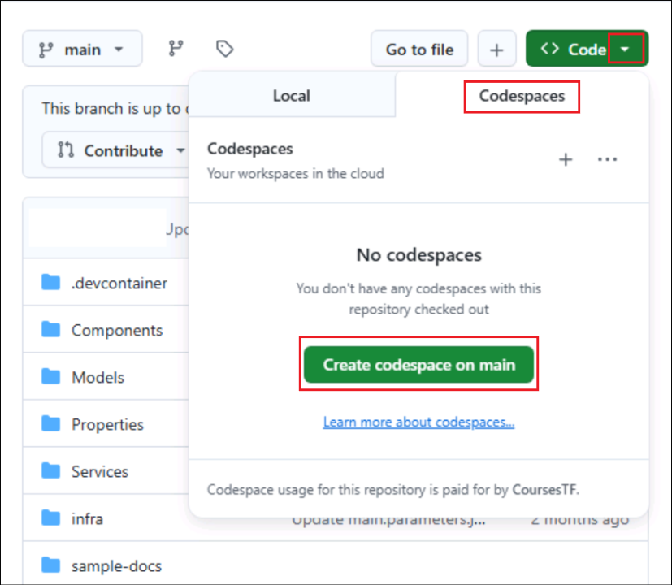

6.  코드스페이스 환경이 설정될 때까지 기다리세요. 완전히 설치하는 데 몇
    분이 걸립니다.

> 

## 작업 2: 주어진 아키텍처를 배포하기

이번 연습에서는 제공된 아키텍처를 Azure 계정에 배포할 것입니다.

1.  터미널에서 Azure Developer CLI를 사용하여 Azure로 로그인하세요:

+++azd auth login+++

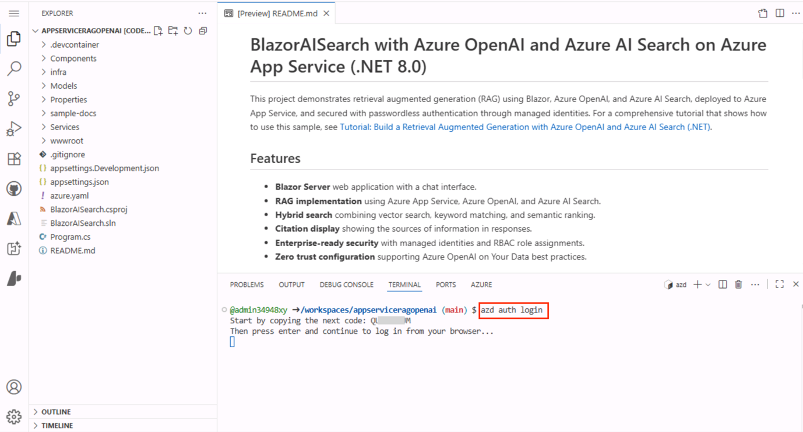

2.  코드를 복사한 후 **Enter** 키를 누르면, 새 브라우저 창이 열리며 해당
    코드를 입력하고 **Next **버튼을 클릭하세요.

3.  다음 자격 증명으로 **Azure account**에 로그인한 후 **Continue**
    버튼을 클릭하세요 .

    - 사용자 이름: <+++@lab.CloudPortalCredential>(User1).Username+++

    - TAP 토큰: <+++@lab.CloudPortalCredential>(User1).AccessToken+++

> 

이제 귀하의 계정이 Codespace 단말기와 성공적으로 연결되었습니다.

4.  터미널에서 다음 명령을 실행하여 AZD 템플릿으로 Azure 리소스를
    프로비저딩하세요:

+++azd provision+++

5.  질문이 나오면 다음 정보를 입력하세요:

    - **Enter a new environment
      Name:** <+++blazorenv@lab.LabInstance.Id>+++

    - **Select Azure Subscription to use:** 구독을 선택하세요

    - **Pick a resource group to use:** **ResourceGroup1**을 선택하세요

6.  배치가 완료될 때까지 기다리세요. 5분에서 10분 정도 걸립니다. 이
    과정은:

    - 필요한 모든 Azure 리소스를 생성하기

    - Deploy the application to Azure App Service에 애플리케이션을
      배포하기

    - 관리형 ID를 사용하여 안전한 서비스 간 인즈을 구성하기

    - 서비스 간 안전한 접근을 위해 필요하느 역할 할당을 설정하기

성공적으로 배포한 후 배포된 애플리케이션의 URL을 볼 수 있습니다.

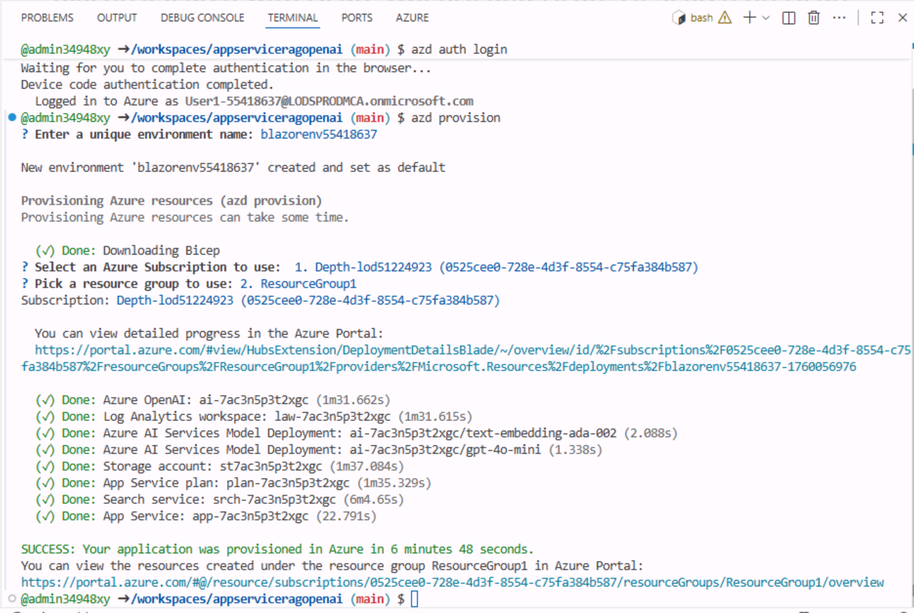

## 작업 3: 문서를 업로드하고 검색 인덱스를 생성하기

인프라가 구축되었으니, 문서를 업로드하고 애플리케이션이 사용할 검색
인덱스를 생성할 것입니다.

1.  **Ctrl+Click**로 주어진 URL을 열면 생성된 모든 리소스를 볼 수
    있습니다.

2.  배포에 생성된 **storage account**를 선택하세요.

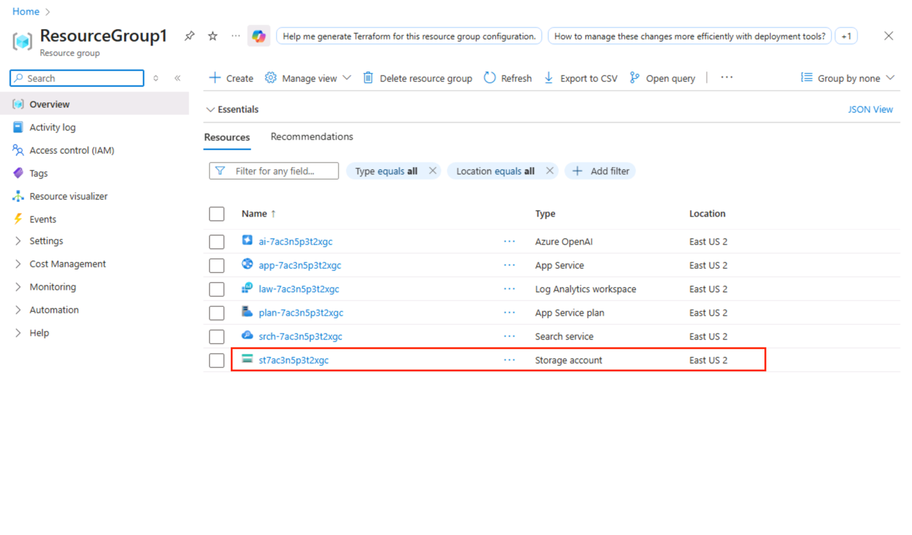

3.  왼쪽 탐색 메뉴의 **Data Storage**에서 **Containers**를 선택하고
    **documents** 컨테이너를 여세요. 문서 컨테이너는 비어 있습니다. 이제
    문서를 업로드할 것입니다.

4.  **Upload** 버튼을 클릭하세ㅔ요.

5.  **Browse for files**을 클릭하고
    **C:\LabFiles\Build-a-RAG-application-using-Azure-OpenAI-and-Azure-AI-Search-and-deploy-to-Azure-App-Service**로
    이동하고 5 가지 문서 모두 선택하고 **Open** 버튼을 클릭하세요.

6.  **Upload**를 클릭하세요.

이 파일들은 문서 컨테이너에서 확인할 수 있습니다.

7.  ResourceGroup1로 다시 이동하고 **Search service**를 선택하세요.

8.  URL을 복사하고 나중에 쓸 수 있도록 메모장에 저장하세요.

9.  개요 페이지에서 검색 인덱스 생성 과정을 시작하려면 **Import
    data(new)**를 선택하세요.

10. Data Source로 **Azure Blob Storage** 를 선택하세요.

11. **RAG**를 선택하세요.

12. **storage account** 및 **documents** 컨테이너를 선택하세요.
    **Authenticate using managed identity**가 선택되는지 확인하고
    **Next**를 클릭하세요.

13. **Azure OpenAI service**를 선택하고 임베딩 모델로
    **text-embedding-ada-002**를 선택하세요. AZD 템플릿은 이미 이 모델을
    배포했습니다. 그 다음 인증을 위해, select **System assigned
    identity**를 선택하고 추가 비용에 대해 확인 체크박스를 선택하세요.
    **Next** 버튼을 클릭하세요.

14. **Vectorize and enrich your images** 단계에서 기본 설정을 유지하고
    **Next**를 선택하세요.

15. **Enable semantic ranker**가 선택되는 확인하고 Next를 클릭하세요.

16. 나중에 사용할 수 있도록 메모장에 **Objects name prefix value**를
    복사하세요. 검색 인덱스 이름이기 때문입니다. 이제 **Create**를
    클릭하면 새인 작업을 시작하세요. 

17. 인덱싱 과정이 완료될 때까지 기다리세요. 문서의 크기와 수에 따라 몇
    분이 걸릴 수 있습니다. 과정이 완료되면 **Close**를 클릭하세요.

18. 다시 한 번, 리소스 그룹을 열고 Azure OpenAI 서비스를 선택하세요.

19. **Endpoint**를 선택하고 나중에 사용할 수 있도록 엔드포인트 값을
    메모장에 복사하세요.

20. Codespace 터미널로 이동해 검색 인덱스 이름을 AZD 환경 변수로
    설정하세요:

+++azd env set SEARCH_INDEX_NAME \<your-search-index-name\>+++

**참고:** \<your-search-index-name\>를 이전에 복사한 인덱스 이름으로
교체하세요. AZD는 이후 배포에서 이 변수를 사용하여 앱 서비스 앱 설정을
설정합니다.

## 작업 4: 애플리케이션을 테스트하고 배포하기

이 작업에서는 배포 전후로 코드를 직접 배포 전에 테스트합니다.
애플리케이션이 제대로 작동하는지 확인한 후에는 배포를 진행할 것입니다.

1.  Codespace 터미널에서 다음 명령어를 사용하여 AZD 환경 값을 얻으세요.

+++azd env get-values+++

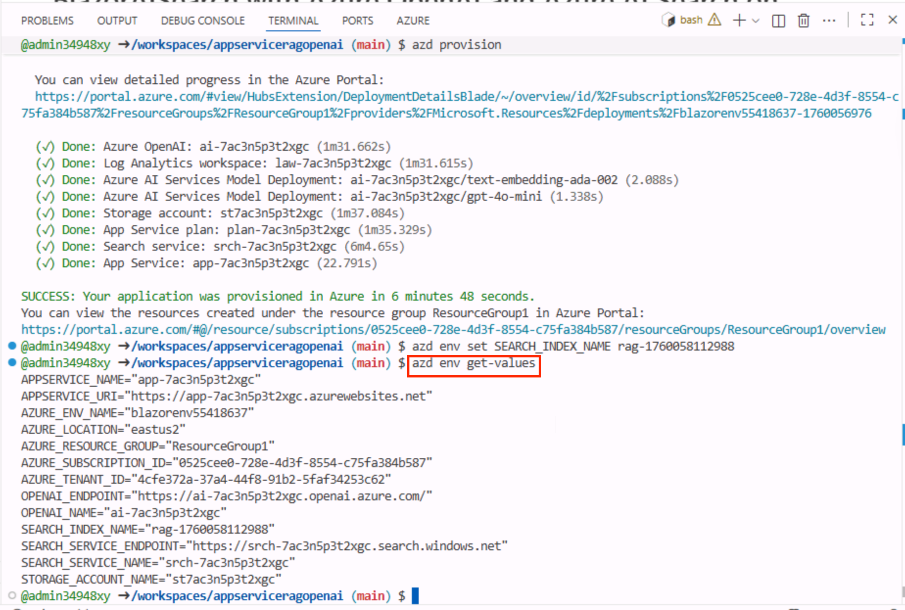

2.  **appsettings.Development.json**을 여세요**.** 터미널 출력을
    사용하여 의 값을 업데이트하세요:

    - "OpenAIEndpoint": "\<value-of-OPENAI_ENDPOINT\>"

    - "SearchServiceUrl": "\<value-of-SEARCH_SERVICE_ENDPOINT\>",

    - "SearchIndexName": "\<value-of-SEARCH_INDEX_NAME\>", 

3.  Azure CLI 사용으로 Azure 로그인하세요:

+++az login --use-device-code+++ 

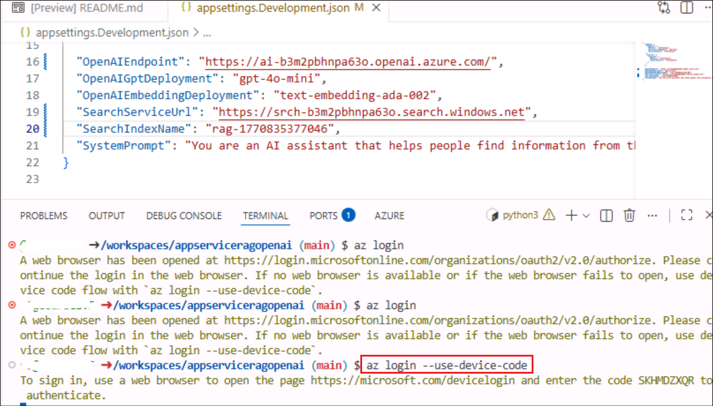

4.  주어진 **URL**을 열고 인증 코드를 입력한 후 **Next **버튼을
    클릭하세요.

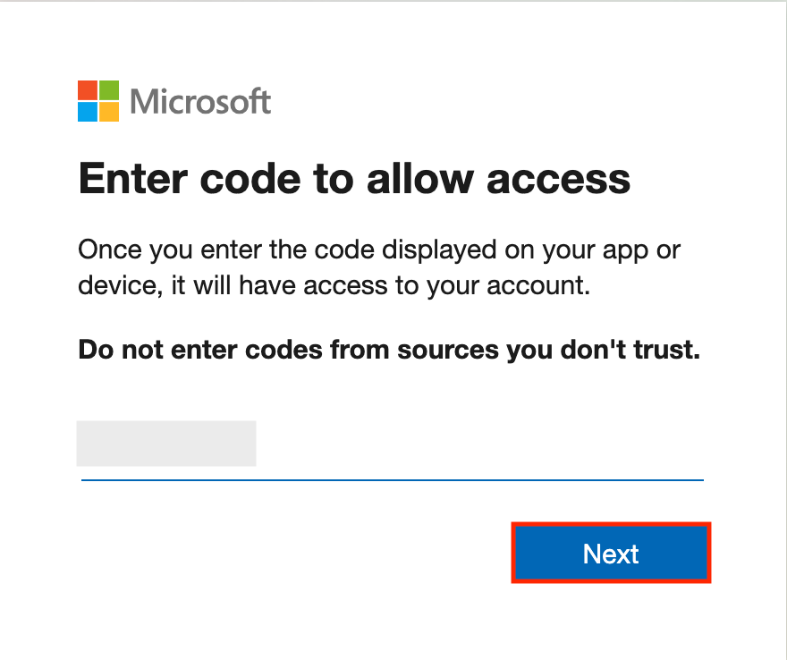

5.  Azure 계정을 선택한 후 **Continue**를 클릭하세요.

> 

6.  애플리케이션을 로컬에서 실행하세요:

+++dotnet run+++

7.  **your application running on port 5017 is available**가 보이면
    **Open in Browser**를 선택하세요.

브라우저에서 앱을 엽니다.

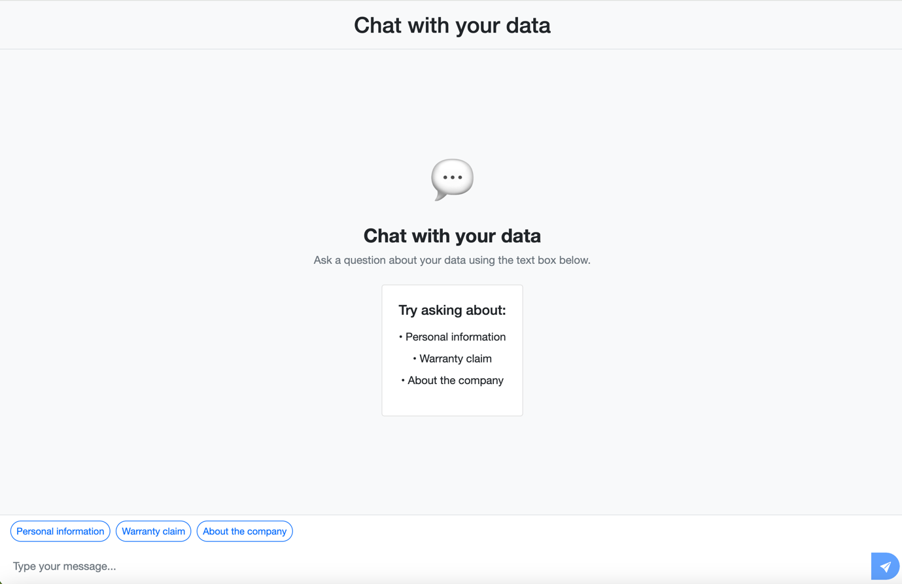

8.  다음 프롬프트를 입력하세요. 응답이 오면 애플리케이션이 Azure OpenAI
    리소스와 성공적으로 연결되고 있다는 뜻입니다.

+++What does Contoso do with my personal information?+++

9.  Ctrl+C**를 눌러** 실행 명령을 종료하세요. 다음으로, 다음 명령어를
    사용하여 애플리케이션을 배포하세요.

+++azd up+++

**참고:** 전개를 완료하는 데 5-10분 정도 걸릴 것입니다.

## 작업 5: 배포된 RAG 애플리케이션을 테스트하기

애플리케이션이 완전히 배포되고 구성되었으니, 이제 RAG 기능을 테스트할 수
있습니다:

1.  배포 종료 시 제공된 애플리케이션 URL을 여세요. 'Do you want Code to
    open the external website?'라는 프롬프트가 표시되면 **Open**을
    클릭하세요.

업로드한 문서의 내용에 대해 질문을 입력할 수 있는 채팅 인터페이스가
보입니다.

2.  다음 질문을 해보세요:

+++**How does Contoso use my personal data?**+++

> +++**How do you file a warranty claim?**+++

응답에 출처 문서를 참조하는 인용이 포함되어 있음을 관찰하세요. 이러한
인용문은 사용자가 정보의 정확성을 확인하고 출처 자료에서 더 많은 세부
정보를 찾는 데 도움을 줍니다.

팝업은 각 줄 끝에 위치한 1 또는 2라고 표시된 파란색 원을 클릭하면
나타납니다.

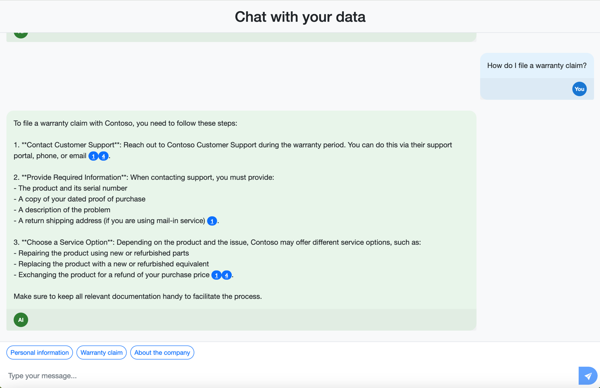

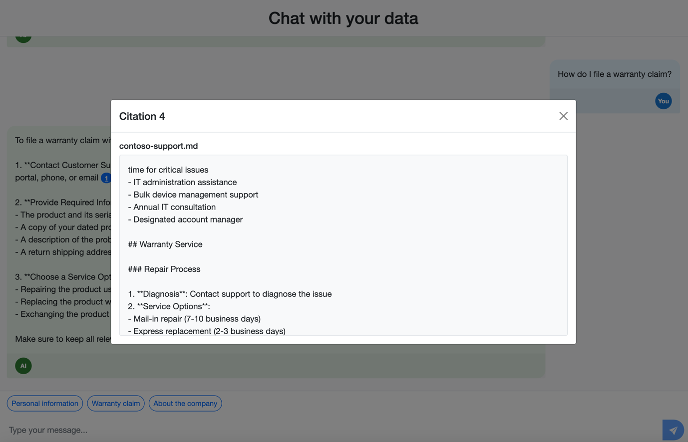

## 요약

이 실습에서는 Azure 자원을 제공해 Azure OpenAI와 Azure AI Search를
통합한 RAG 기반 .NET Blazor 웹 애플리케이션을 구축합니다. 문서 색인과
임베딩을 결합한 하이브리드 검색을 구성하여 인용과 함께 문맥 기반 Q&A를
가능하게 합니다. 이 애플리케이션은 안전한 접근을 위해 관리형 ID를
사용하여 GitHub Codespaces에서 로컬 테스트가 이루어집니다. 마지막으로,
Azure App Service에 배포되어 Azure AI가 지원하는 라이브 채팅
인터페이스를 통해 검증됩니다.
